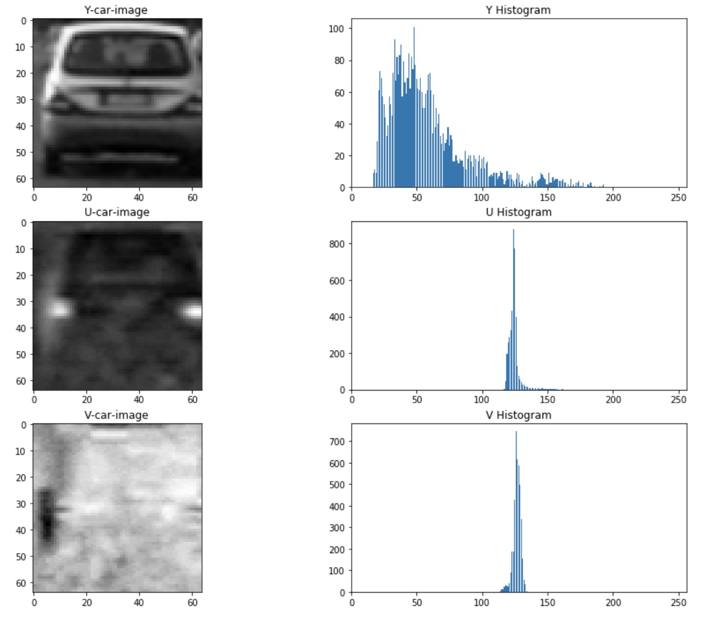
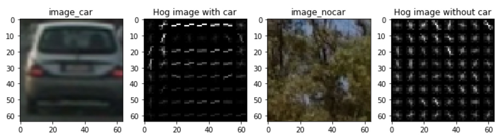
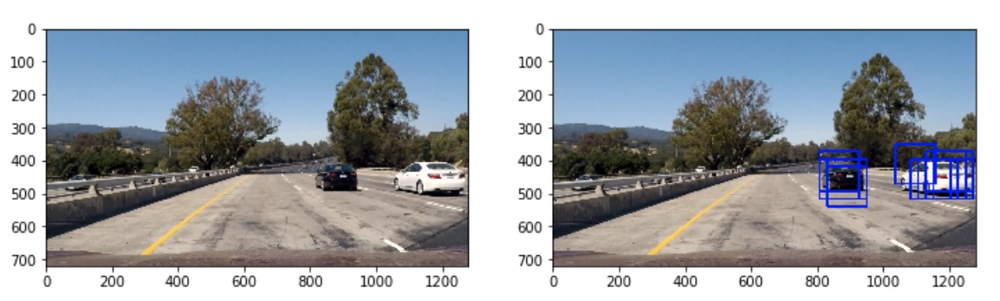
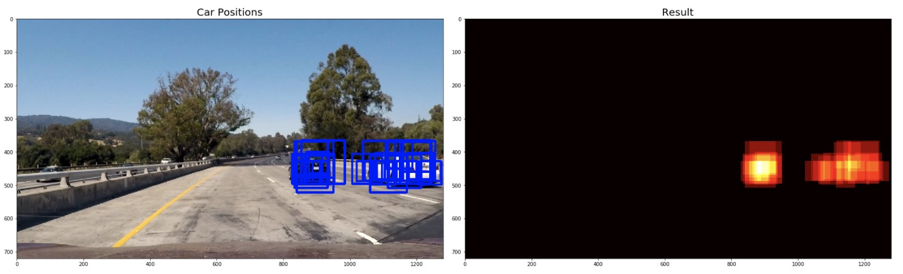
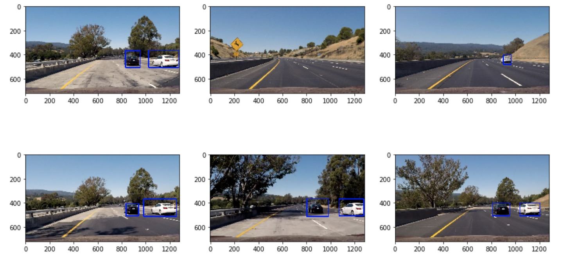

# CarND-Vehicle-Detection

The goals / steps of this project are the following:

* Perform a Histogram of Oriented Gradients (HOG) feature extraction on a labeled training set of images and train a classifier Linear SVM classifier
* Optionally, you can also apply a color transform and append binned color features, as well as histograms of color, to your HOG feature vector. 
* Note: for those first two steps don't forget to normalize your features and randomize a selection for training and testing.
* Implement a sliding-window technique and use your trained classifier to search for vehicles in images.
* Run your pipeline on a video stream (start with the test_video.mp4 and later implement on full project_video.mp4) and create a heat map of recurring detections frame by frame to reject outliers and follow detected vehicles.
* Estimate a bounding box for vehicles detected.

### Histogram of color(HC)
&emsp;In this part, I choose YUV as my color space. Since U channel and V channel contain information including chrominance and saturability, they donnot affact classification. Therefore, I only use Y channel, which represents luminance.
```python
def color_hist(img, nbins=32):
    channel1_hist = np.histogram(img[:,:,0], bins=nbins)
    hist_features = channel1_hist[0]
    return np.array(hist_features)
```


### Histogram of Oriented Gradients (HOG)
&emsp;The scikit-image hog() function takes in a single color channel or grayscaled image as input, as well as various parameters. These parameters include orientations, pixels_per_cell and cells_per_block.
&emsp;The number of orientations is specified as an integer, and represents the number of orientation bins that the gradient information will be split up into in the histogram. Typical values are between 6 and 12 bins.
&emsp;The pixels_per_cell parameter specifies the cell size over which each gradient histogram is computed. This paramater is passed as a 2-tuple so you could have different cell sizes in x and y, but cells are commonly chosen to be square.
&emsp;The cells_per_block parameter is also passed as a 2-tuple, and specifies the local area over which the histogram counts in a given cell will be normalized. Block normalization is not necessarily required, but generally leads to a more robust feature set.

#### 1. Compare different images
```python
from skimage.feature import hog
features, hog_image = hog(img,orientations,pixels_per_cell,cells_per_block,transform_sqrt=False, visualise=True, feature_vector=True)
```



#### 2. HOG parameters.

```python
color_space = 'YUV' # Can be RGB, HSV, LUV, HLS, YUV, YCrCb
orient = 15  # HOG orientations
pix_per_cell = 8 # HOG pixels per cell
cell_per_block = 2 # HOG cells per block
hog_channel = 0 # Can be 0, 1, 2, or "ALL"
spatial_size = (32, 32) # Spatial binning dimensions
hist_bins = 32    # Number of histogram bins
```


### train a classifier
#### 1. Combine features.
combine histogram of color features and histogram of oriented gradients features.
total feature numbers: 2972.
```python
hist_features = color_hist(image, nbins=hist_bins)
features.append(hist_features)
hog_features = get_hog_features(image[:,:,hog_channel], orient, pix_per_cell, cell_per_block, vis=False, feature_vec=True)
features.append(hog_features)
```
#### 2.Select traning data
&emsp;The number of withcar images is 8636. The number of nocar images is 8968. Therefore, we get only 1/5 of the training data to avoid overfitting. The number of selected withcar images is 1728. The number of selected nocar images is 1794.
#### 3.SVM classifier
Get a StandardScaler (mean:0,variance:1) with training data. And use the same data to train a LinearSVC classifier.
```python
X_scaler = StandardScaler().fit(X)
scaled_X = X_scaler.transform(X)
X_train, X_test, y_train, y_test = train_test_split(scaled_X, y, test_size=0.2, random_state=rand_state)
svc = LinearSVC()
svc.fit(X_train, y_train)
```
4.12 Seconds to train SVC...
Test Accuracy of SVC =  0.9574
### Sliding Window Search

#### 1. How to implemente a sliding window search.
We need two functions. The first function is **slide_window()**. This function is used to define search range, window size and overlap area. It will return every window location. The second function is **search_windows()**. This function is used to resize windows and judges whether a window contains cars. The SVM classifier is used here.There is an example.
```python
#We will get 100 windows
windows = slide_window(image,x_start_stop=[600, None], y_start_stop=[350, 550],xy_window=(120, 120), xy_overlap=(0.8, 0.8))
#we will get 11 windows that contain cars.
search_windows(image,windows,svc,X_scaler,...)
draw_boxes(img...)
```

Only one size of windows is not enough. I set 8 size of windows from (60,60) to (130,130) with overlap size (0.6,0.6). What's more, I use heatmap to represent the posibility of finding cars.

More examples

### Discussion
&emsp;This method can detect the trail of vehicles easily. However, it cannot detect the left side of vehicles accurately. I find two reasons. First, most of traning data is the trail of vehicles. Therefore, the classifier was trained with overfitting. Second, if you observe *GTI-right* file. You will find that only a few parts of images contain vehicle sides. What's more, the angle of view in training data is very small. Therefore, the classifier cannot detect the whole left side of a vehicle. We can add zoom function to improve this part.


